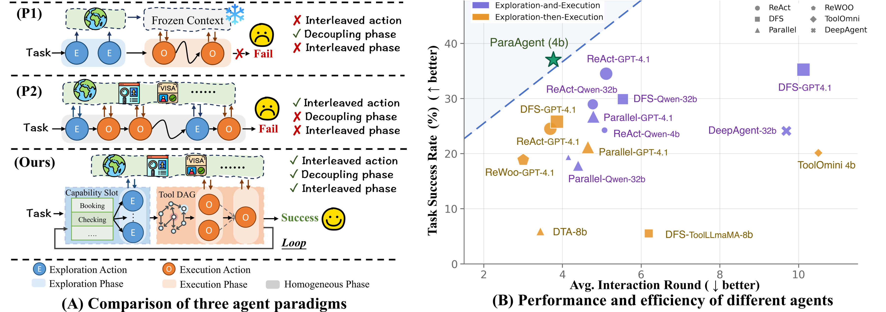
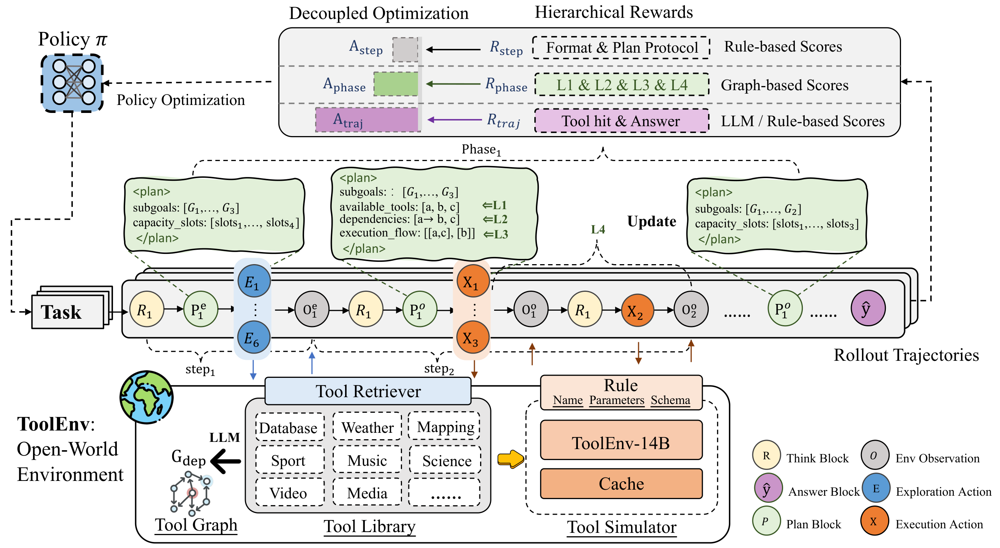

<div align="center">


<h3>Reinforcing Parallel Acting in Open-World Tool Environments</h3>

<p>
Shengbin Yue<sup>1</sup> · Hongru Wang<sup>3</sup> · Siyuan Wang<sup>4</sup> ·
Xiaoxin Chen<sup>6</sup> · Wei Chen<sup>5</sup> ·
Zhongyu Wei<sup>1,2</sup>
</p>

<p><sub>
<sup>1</sup> Fudan University ·
<sup>2</sup> Shanghai Innovation Institute ·
<sup>3</sup> University of Edinburgh ·
<sup>4</sup> The Chinese University of Hong Kong ·
<sup>5</sup> Huazhong University of Science and Technology ·
<sup>6</sup> vivo AI
</sub></p>

<p>
<a href="https://github.com/yueshengbin/paraagent"></a>
<a href="https://arxiv.org/abs/2609.33618"></a>
<a href="https://huggingface.co/papers/2609.33618"></a>
</p>

</div>

## What is ParaAgent?

Language-model agents increasingly operate in **open-world tool environments**, where task requirements and useful capabilities emerge through interaction. Existing methods either adopt Exploration-then-Execution (`ETE`), which is efficient but brittle, or Exploration-and-Execution (`EaE`) in a flat action sequence, which is adaptive but interaction-heavy. **ParaAgent argues that the key is not whether to separate or interleave them, but how to coordinate them across granularities.**

<div align="center">

</div>

<div align="center"><sub><b>Paradigm comparison.</b> ParaAgent coordinates adaptive phase transitions with parallel actions inside each phase.</sub></div>

We introduce **ParaAct**, a structured parallel-action loop that combines phase-level `Exploration ↔ Execution` with action-level parallelism. Exploration parallelism identifies required capability slots and retrieves them concurrently; execution parallelism organizes selected tools into a DAG and executes dependency-independent calls in parallel.

**ParaAgent** learns this loop from multi-agent cold-start demonstrations followed by reinforcement learning with multi-level advantage decoupling. Explicit phase plans expose structural decisions, while step-, phase- and trajectory-level rewards supervise protocol compliance, dependency-aware coordination and task outcomes. Training is supported by **ToolEnv**, a scalable environment built from realistic tool interfaces.

<div align="center">

</div>

<div align="center"><sub><b>Overview of ParaAgent.</b> Multi-agent cold-start demonstrations initialize ParaAct; reinforcement learning with decoupled step-, phase- and trajectory-level signals refines the policy through interaction with ToolEnv.</sub></div>

---

**We will release the following resources:**

1. **Datasets**
   - [ParaAgent SFT dataset](https://huggingface.co/datasets/ShengbinYue/paraagent-sft).
   - [ParaAgent RL dataset](https://huggingface.co/datasets/ShengbinYue/paraagent-rl).
   - [ToolEnv SFT dataset](https://huggingface.co/datasets/ShengbinYue/ToolEnv-sft).

2. **Models**
   - ParaAgent-4B model weights — coming soon.
   - ToolEnv-14B model weights — coming soon.

## Repository layout

```text
paraagent/
├── assets/                README wordmark and method figures
├── src/paraagent/
│   ├── training/          RL launcher, rollout workers and trainer integration
│   ├── rewards/           trajectory, phase and format rewards
│   ├── toolenv/           ToolEnv runtime, simulator and retrieval service
│   ├── paraact/           inference loop, protocols and model clients
│   ├── evaluation/        ToolBench and API-Bank adapters and scorers
│   └── data/              portable data validation
├── sft/LLaMA-Factory/     pinned SFT training-source snapshot
├── configs/               training, runtime, prompt and evaluation settings
├── scripts/
│   ├── train/             ToolEnv SFT, ParaAgent SFT/RL and export launchers
│   ├── serve/             ToolEnv, policy and judge serving launchers
│   ├── data/              RL JSONL-to-Parquet conversion and retrieval indexing
│   └── setup/             isolated vLLM CuMem compatibility build
├── data/                  training data, benchmark data and runtime resources
├── patches/               pinned verl and vLLM runtime patches
├── requirements/          SFT/serving and RL dependencies with key versions pinned
└── docs/                  installation and usage guides
```

## Installation

Prepare the framework environment first, check the data, then run the corresponding stage. Both environments use **Python 3.12**:

| Environment | Frameworks | Used for |
|---|---|---|
| `paraagent` | LLaMA-Factory + DeepSpeed; vLLM 0.19.0 | both SFT stages, model services, retrieval and evaluation |
| `paraagent-rl` | pinned verl + vLLM 0.11.0 | RL training and policy rollouts |

Follow the [installation guide](docs/installation.md) to create the environments and run the setup checks. ParaAgent SFT and ToolEnv SFT share `paraagent` with the standalone model services. Each service runs in a separate process with its own GPU assignment. RL calls these services over HTTP; its rollout engine stays inside `paraagent-rl`.

The installation layout follows [Agent-R1's framework-first setup](https://github.com/AgentR1/Agent-R1#getting-started). Use the versions specified here for ParaAgent's existing integration.

## Data

See the [data guide](docs/data.md) for dataset structure, downloads and validation.

## Training

Train in this order. Activate `paraagent` for both SFT stages and `paraagent-rl` for RL:

### 1. ToolEnv SFT

```bash
bash scripts/train/toolenv-sft.sh
```

The default configuration uses Qwen3-14B, 243,445 examples, two epochs, full-parameter SFT and a 4,096-token cutoff.

### 2. ParaAgent SFT

```bash
bash scripts/train/paraagent-sft.sh
```

The default configuration uses Qwen3-4B, full-parameter SFT. Both SFT stages supervise assistant outputs.

Launcher arguments override the YAML configuration. For example:

```bash
bash scripts/train/paraagent-sft.sh \
  model_name_or_path=/path/to/Qwen3-4B
```

### 3. ParaAgent RL

If starting from the released RL JSONL files, generate the training Parquet files first using the converter and default system prompt maintained in this code repository. See [RL data preparation](docs/data.md#rl-data) for download instructions and prompt options:

```bash
python scripts/data/prepare_rl.py --data-dir data/rl/paraagent-rl
```

Start the ToolEnv simulator, ToolEnv retriever and RL answer judge, then run:

```bash
bash scripts/train/paraagent-rl.sh --check
bash scripts/train/paraagent-rl.sh
```

The paper-aligned preset uses 8 H200 GPUs, a prompt batch of 256, two epochs, eight rollouts per prompt and at most 15 reasoning/action turns, for 128 outer updates. Training outputs go to `outputs/paraagent-rl`.

Export a selected FSDP actor checkpoint for serving:

```bash
bash scripts/train/export-paraagent-rl.sh \
  outputs/paraagent-rl/global_step_N/actor
```

See [training](docs/training.md).

## Runtime services

Activate `paraagent` in each service terminal. Run each model service as a separate process:

```bash
CUDA_VISIBLE_DEVICES=0 \
  bash scripts/serve/toolenv.sh /path/to/toolenv-sft

CUDA_VISIBLE_DEVICES=1 \
  bash scripts/serve/paraagent.sh /path/to/paraagent-rl-hf

TP_SIZE=8 \
  bash scripts/serve/judge.sh Qwen/Qwen3-235B-A22B-Instruct-2507
```

Default service endpoints are:

| Service | Endpoint | Used by |
|---|---|---|
| ToolEnv simulator | `http://127.0.0.1:12345/v1` | RL and ToolBench cache misses |
| ParaAgent policy | `http://127.0.0.1:8000/v1` | ParaAct inference |
| RL answer judge | `http://127.0.0.1:22456/v1` | RL reward computation |

Start the retriever for the required catalog:

```bash
toolenv-retriever --catalog toolenv --port 30400
toolenv-retriever --catalog toolbench --port 30401
toolenv-retriever --catalog apibank --port 30403
```

The retriever uses the prepared BGE-large-en-v1.5 index. Set `--model BAAI/bge-large-en-v1.5` explicitly when required. To generate embeddings and indexes from the tool corpora, see [Build retrieval indexes](docs/inference.md#build-retrieval-indexes).

See [runtime services and inference](docs/inference.md) for service parameters and runtime behavior.

## Evaluation

Run ParaAgent or GPT-ReAct on ToolBench and API-Bank with `paraact`; score predictions with `paraagent-eval`. ToolBench supports local simulation, StableToolBench GPT/cache (`virtual`), MirrorAPI (`mirrorapi`) and real API calls (`live`).

See [evaluation](docs/evaluation.md) for setup, backend selection, API keys, commands and metrics.

## Configuration reference

| Purpose | Configuration |
|---|---|
| ToolEnv SFT | `configs/train/toolenv-sft.yaml` |
| ParaAgent SFT | `configs/train/paraagent-sft.yaml` |
| ParaAgent RL | `configs/train/paraagent-rl.yaml` |
| ToolEnv runtime | `configs/toolenv/runtime.yaml` |
| ToolEnv simulator | `configs/toolenv/simulator.yaml` |
| ParaAgent system prompt | `configs/prompts/paraagent.txt` |
| Evaluation API key variables | `.env.example` |
| GPT-ReAct inference API | `configs/eval/inference-react.example.json` |
| ParaAgent inference API | `configs/eval/inference-paraagent.example.json` |
| ToolBench scoring API | `configs/eval/scoring.example.json` |

## Acknowledgements

We thank the teams behind [Agent-R1](https://github.com/AgentR1/Agent-R1) and [LLaMA-Factory](https://github.com/hiyouga/LLaMA-Factory) for releasing their excellent open-source projects. ParaAgent builds its reinforcement-learning pipeline on Agent-R1 and uses LLaMA-Factory for supervised fine-tuning.

## Citation

If ParaAgent is useful in your work, please cite:

```bibtex
@article{yue2026paraagent,
  title={ParaAgent: Reinforcing Parallel Acting in Open-World Tool Environments},
  author={Yue, Shengbin and Wang, Hongru and Wang, Siyuan and Chen, Xiaoxin and Chen, Wei and Wei, Zhongyu},
  journal={arXiv preprint arXiv:2609.33618},
  year={2026}
}
```
